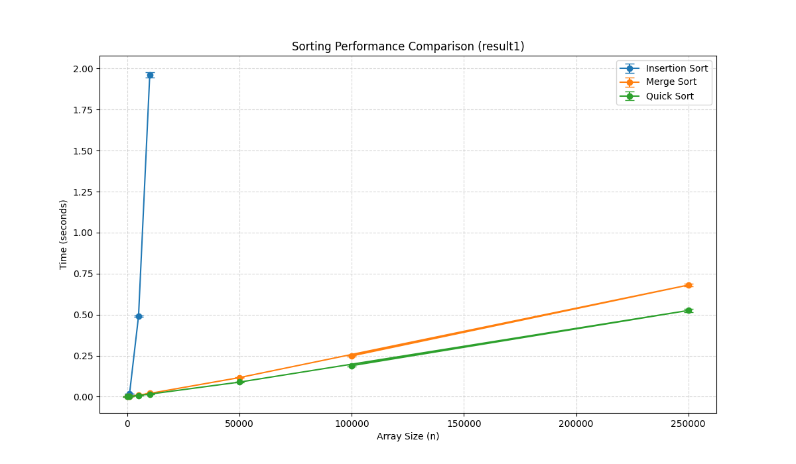
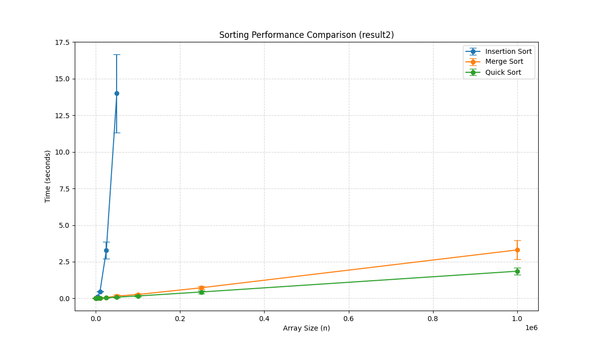

# Sorting Algorithm Performance Analysis – Assignment 1

**Submitted by:** Eitan Karp, Oren Avishid

**Course:** Data Structures - Spring 2026

## Project Overview
The goal of this assignment is comparing the running times of different sorting algorithms. We conducted experiments to see how various data distributions (random vs. nearly sorted) and increasing array sizes affect performance.

### Selected Algorithms
We chose the following three algorithms for our comparison:
* **Insertion Sort (ID 3):** A simple algorithm with $O(n^2)$ complexity.
* **Merge Sort (ID 4):** A stable divide-and-conquer algorithm with $O(n \log n)$ complexity.
* **Quick Sort (ID 5):** An efficient algorithm with average $O(n \log n)$ complexity, using a middle-element pivot strategy.


### Operational Notes
Insertion Sort approaches linear $O(n)$ complexity in nearly sorted arrays because each element requires only a few comparisons and swaps to reach its correct position, significantly reducing the total number of operations compared to a random distribution.

* **Dynamic Performance Guardrail:** To prevent the program from hanging during $O(n^2)$ operations, the script automatically caps **Insertion Sort** based on the input's noise level:
    * **Random Data:** Capped at 25,000 elements.
    * **Nearly Sorted (20% Noise):** Capped at 50,000 elements.
    * **Nearly Sorted (5% Noise):** Capped at 100,000 elements.
    * 
* **Output:** Upon completion, the script prints a detailed results table to the terminal and saves the generated plot as a `.png` file.
---

## Results Analysis – Part B: Random Arrays



As shown in the `result1.png` plot, there is a massive disparity between the growth rates:
* **Merge Sort & Quick Sort:** These algorithms demonstrate high efficiency, maintaining a near-linear growth rate even as the size reaches 1,000,000 elements.
* **Insertion Sort:** Shows a steep quadratic curve $O(n^2)$. Its execution time becomes the dominant factor even at relatively small array sizes.

### Array Size Limit for Insertion Sort
In our implementation, we intentionally skip Insertion Sort for arrays larger than **25,000** elements. Since it has a quadratic time complexity, doubling the input size quadruples the execution time. Sorting 1,000,000 elements would be approximately 1600 times slower than sorting 50,000 elements, which is impractical for a standard test run.

#### Theoretical Runtime Estimation
We can estimate the time Insertion Sort would have taken for 1,000,000 elements using our result from the 50,000-element test. 

If $n_1 = 25,000$ and $n_2 = 1,000,000$, the ratio is 40. The estimated time $T_2$ is:
$$T_2 = T_1 \times (40^2) = T_1 \times 1600$$

**Based on our experimental measurements:**
* **Average measured time for 25,000 elements ($T_1$):** 18.8 seconds.
* **Estimated time for 1,000,000 elements:** 30,080 seconds (approx. 8 hours).

---

## Results Analysis – Part C: Nearly Sorted Arrays (20% Noise)



In this experiment, we added "noise" by randomly swapping 20% of the elements in a sorted array:
* **Insertion Sort:** Performance improves compared to the random test because the algorithm performs fewer swaps when elements are close to their final positions (as stated before). However, it is still significantly slower than $O(n \log n)$ alternatives.
* **Merge Sort:** The runtime remains identical to the random test. Merge Sort's division logic is independent of the initial order of the data.
* **Quick Sort:** Continues to be the fastest, as the middle-pivot strategy handles partially ordered data efficiently without falling into worst-case behavior.

### Array Size Limit for Insertion Sort
For the same reason as in the random array (Running for too long), Insertion sort was capped at **50,000** elements as mentioned in the operational notes (20% noise)

#### Lower Bound Estimation
Because Insertion Sort performs more linearly on nearly sorted data, the quadratic approximation $O(n^2)$ used for random arrays would result in an unrealistically high estimate. Instead, we can calculate a **lower bound** based on its best-case linear complexity $O(n)$. 

Given that the algorithm must inspect every element at least once, we can estimate that sorting 1,000,000 elements will take at least 20 times longer than sorting 50,000 elements:

* **Measured average for 50,000 elements ($T_1$):** 14 seconds
* **Size Ratio:** $1,000,000 / 50,000 = 20$
* **Estimated Lower Bound ($T_2$):** $14 \times 20 = \mathbf{280}$ **seconds**

In practice, due to the 20% noise level, the actual time would be higher than this lower bound, but this calculation demonstrates that even in a nearly-sorted state, the overhead of the algorithm scales significantly compared to Merge or Quick Sort.

---

## How to Run the Experiments

The program includes a Command Line Interface (CLI) that allows for precise control over the experimental parameters.

### Available Arguments
* **`-a`, `--algorithms`**: Specify which algorithms to include in the test by their ID.
    * `3`: Insertion Sort
    * `4`: Merge Sort
    * `5`: Quick Sort
    * *Example:* `-a 3 4 5`
* **`-s`, `--sizes`**: A space-separated list of array sizes ($n$) to be tested.
    * *Example:* `-s 100 1000 10000 100000 1000000`
* **`-e`, `--experiment`**: Defines the data distribution and noise level.
    * `0`: Fully Random integers (saves to `result1.png`).
    * `1`: Nearly Sorted with 5% noise (saves to `result2.png`).
    * `2`: Nearly Sorted with 20% noise (saves to `result2.png`).
* **`-r`, `--repetitions`**: The number of times to repeat each test case to calculate the average and standard deviation.

### Example Command
To run the experiment for all three algorithms on nearly-sorted data with 20% noise across multiple sizes:
```bash
python run_experiments.py -s 100 1000 5000 10000 50000 100000 250000 1000000 -e 2 -r 5
